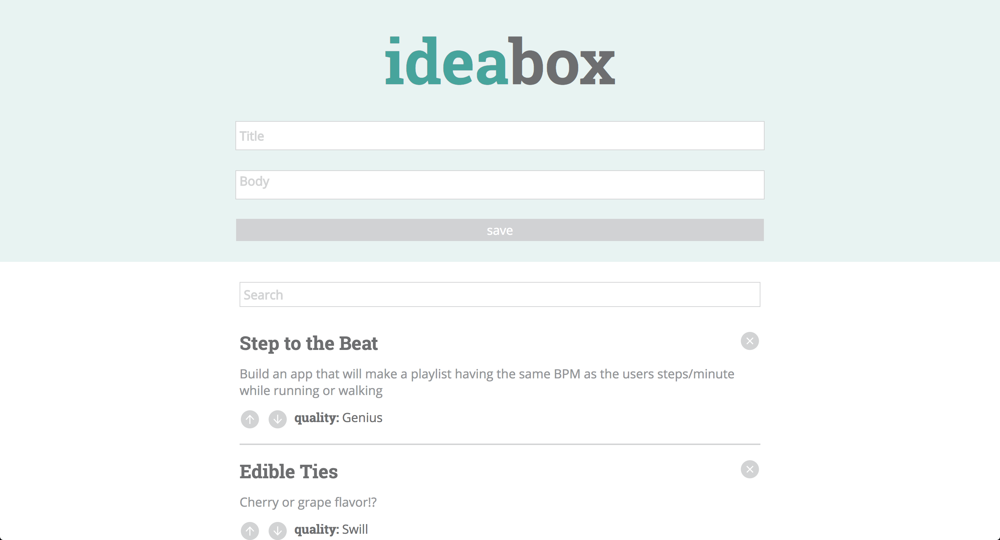

# IdeaBox - Alex Bonder, Melena Suliteanu - (FE Module 1)

## Synopsis

IdeaBox is a paired project which generates idea cards based on user input. The user can then toggle the quality of the idea, use the search bar to filter cards based on the text inside of them, and edit the text directly on the cards.

[Project Spec](http://frontend.turing.io/projects/ideabox.html)

## Project Goals

* Learn and implement use of local storage.
* Improve technique involving DOM manipulation and event bubbling.
* Adhere to project comp.

## Installation

Fork or clone this project

Open `index.html` in the browser

## Screenshots

